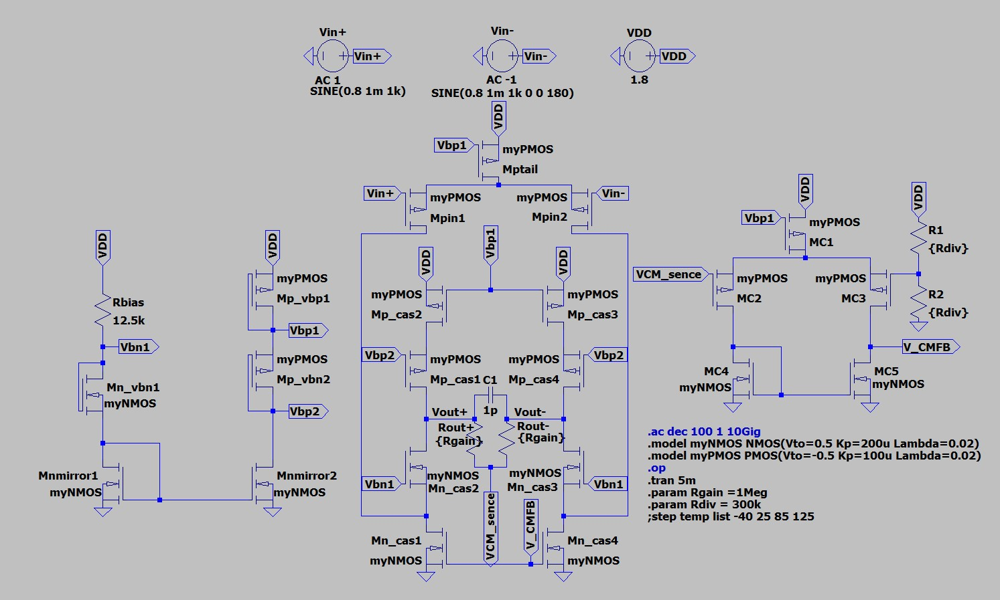
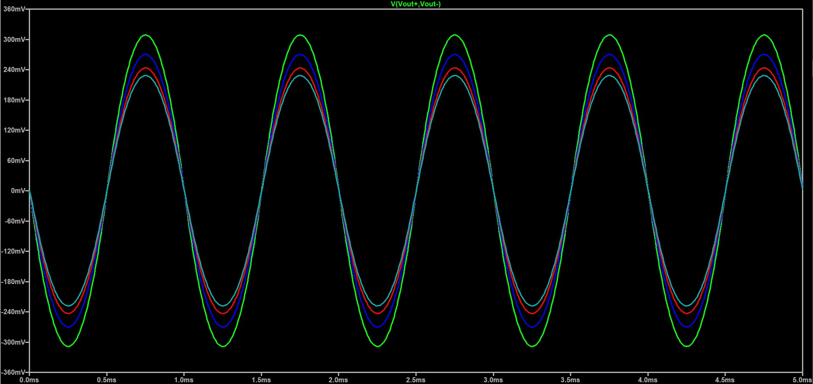
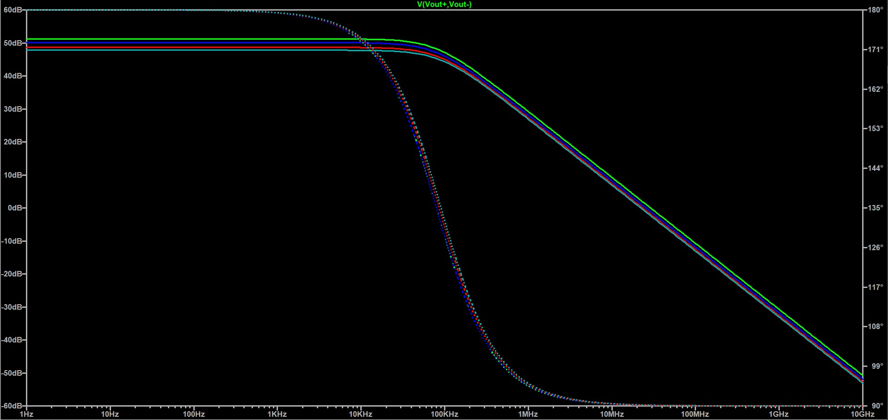
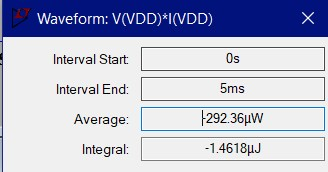

# Fully_Differential_Folded_Cascode_OTA_with_CMFB

A complete transistor-level 2 Stage CMOS Miller Op-Amp design. The circuit receives a weak 1kHz sine with 1mV Amplitude and 0.8V dc offset, amplifies it with 51.2dB gain (270mV Amplitude, 1MΩ/1MΩ resistor Pair). The circuit consists of 3 key components. The first component is responsible for creating the bias Voltages for the Folded Cascode OTA. One NMOS and two PMOS are used to achieve the necessery Voltage Values, while a NMOS Current Mirror provides the 2 sections with the same current. The second component is the Fully Differential Folded Cascode OTA. 2 PMOS are used as the input transistors, which are powered by another PMOS transistor with 15 μΑ each. The AC signal is then folded in the middle of a NMOS cascode topology. The output of the amplifier is between a NMOS and a PMOS cascode topology, to achieve high output resistance. Lastly, the third component is a CMFB, that solves the Undefined Output Voltage Level promblem. With the use of two resistors (Rout+, Rout-), the avarage output voltage of the amplifier is calculated and is then compared with the 0.9V desired Value. The CMFB's output is a stable 0.7V output, that adapts dynamically to the voltage swings of the amplifier's output. This stable voltage is then fed back to the amplifier, keeping the voltage sensitive circuit, functioning. The desired 0.9V are calculated by a Voltage divider (R1,R2). The circuit achieves consumption < 300μW. The circuit is also tested and evaluated under different temperatures. 

All simulations and validations were performed in **LTspice**.

## Key Specifications

| Parameter | Value / Description |
| :--- | :--- |
| **Technology** | Generic NMOS Vth= 0.5V Kp=200u Lambda=0.02 (W/L) = (4u/1u), Generic NMOS Vth= 0.5V Kp=200u Lambda=0.02 (W/L) = (8u/1u), Generic PMOS Vth=-0.5V Kp=100u Lambda=0.02 (W/L) = (8u/1u), Generic PMOS Vth=-0.5V Kp=100u Lambda=0.02 (W/L) = (16u/1u)|
| **Supply Voltage (VDD)** | 1.8V |
| **Virtual Ground / DC Bias** | 0V |
| **Input Signal Amplitude** | 1mV |
| **Carrier Frequency** | 1kHz |
| **Current** | 30μΑ |
| **Bias Resistor** | 12.5kΩ |
| **Avarage Output Pair Resistors** | 1MΩ/1MΩ |
| **Voltage Divider Pair Resistors** | 300kΩ/300kΩ |
| **Load Capacitor** | 1pF |
| **Bandwidth** | 0 - 81.5k|
| **Midband Gain** | 51.2B (open loop), 55.1dB (negative feedback)|
| **Vbn1** | 1.4V |
| **Vbp1** | 1.1V |
| **Vbp2** | 0.4V |
| **V_CMFB** | 0.7V |

## Transistor W/L Reference Table
| Name |Type | W/L |
| :--- | :--- | :--- |
|**Mn_vbn1**| NMOS | 8u/1u |
|**Mnmirror1**| NMOS | 8u/1u |
|**Mnmirror2**| NMOS | 8u/1u |
|**Mp_vbp1**| PMOS | 16u/1u |
|**Mp_vbp2**| PMOS | 16u/1u |
|**Mptail**| PMOS | 16u/1u |
|**Mpin1**| PMOS | 8u/1u |
|**Mpin2**| PMOS | 8u/1u |
|**Mn_cas1**| NMOS | 8u/1u |
|**Mn_cas2**| NMOS | 4u/1u |
|**Mn_cas3**| NMOS | 4u/1u |
|**Mn_cas4**| NMOS | 8u/1u |
|**Mp_cas1**| PMOS | 8u/1u |
|**Mp_cas2**| PMOS | 8u/1u |
|**Mp_cas3**| PMOS | 8u/1u |
|**Mp_cas4**| PMOS | 8u/1u |
|**MC1**| PMOS | 16u/1u |
|**MC2**| PMOS | 8u/1u |
|**MC3**| PMOS | 8u/1u |
|**MC4**| NMOS | 4u/1u |
|**MC5**| NMOS | 4u/1u |

## Schematics & Simulation Results

### Schematic

### Transient Analysis
The system was evaluated with the use of a weak 1mV input signal to verify the circuit's gain.

- **Green Trace:** Amplified Output Signal at -40C
- **Blue Trace:** Amplified Output Signal at 25C
- **Red Trace:** Amplified Output Signal at 85C
- **Light Blue Trace:** Amplified Output Signal at 125C

### AC Analysis

- **Green Trace:** Gain at -40C
- **Blue Trace:** Gain at 25C
- **Red Trace:** Gain at 85C
- **Light Blue Trace:** Gain at 125C
  

### Consumption

---
